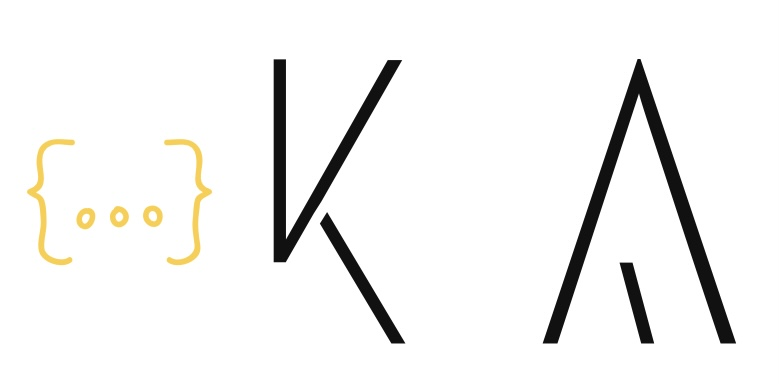

<!--
**kiarashAlizadeh/kiarashAlizadeh** is a ✨ _special_ ✨ repository because its `README.md` (this file) appears on your GitHub profile.

Here are some ideas to get you started:

- 🔭 I’m currently working on ...
- 👯 I’m looking to collaborate on ...
- 🤔 I’m looking for help with ...
- 💬 Ask me about ...
- 😄 Pronouns: ...
- ⚡ Fun fact: ...

### Languages 🌐

| Language      | Proficiency                                                               |
| ------------- | ------------------------------------------------------------------------- |
| English (duh) | C2 ([EFSET certified](https://www.efset.org/cert/5P5Pp1))                 |
| German        | B1 ([DSD Certificate](https://www.goethe.de/en/spr/kup/prf/prf/gb1.html)) |
| Czech         | Native language                                                           |

-->

<h1 align="center">
   
  
   
  Kiarash Alizadeh
</h1>

<h4 align="center"> A junior front end developer, from Iran!</h4>

- 🌱 I’m currently learning "React.js"

- 📫 How to reach me: Kiarash_Alizadeh@yahoo.com

## My expertise

  

## Languages 🌐

| Language      | Proficiency                                                               |
| ------------- | ------------------------------------------------------------------------- |
| English       | fluent                |
| German        | B2 |
| persian       | Native language                                                           |

## My social networks

## GitHub activity
* The most languages I used in GitHub

* GitHub stats:  

