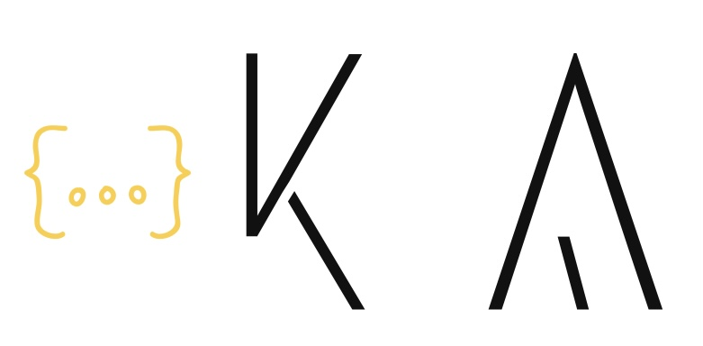

<h1 align="center">
   
  
   
  ＫＩΛＲΛＳＨ &nbsp ΛＬＩＺΛＤΞＨ
</h1>

<h3 align="center">Backend & Distributed Systems Engineer</h3>

 

## <picture></picture> About me

<picture> </picture>
- 🔭 Backend engineer with **5+ years of experience**, specialized in **Go-based distributed systems**
- ⚙️ I build scalable **gRPC & REST APIs**, event-driven microservices, and high-performance backends
- 🏗️ Co-founded **TUT Learning** — led a 17+ person engineering team and designed the modular backend architecture
- 🚀 Currently engineered high-throughput infrastructure for enterprise clients handling **100K+ daily requests**
- 💬 Ask me about **Go, Microservices, gRPC, Kafka, PostgreSQL, Docker**
- 📫 Reach me at: **kiarash_alizadeh@yahoo.com**
 
 

 
 

##  My Expertise

- **Languages & Runtimes:**
  
  
  
  
  

- **API Engineering & Frameworks:**
  
  
  
  
  

- **Databases & Messaging (Event-Driven):**
  
  
  
  
  
  

- **DevOps, Cloud & Infrastructure:**

  
  
  
  

- **Observability & Testing:**

  
  
  
  
  

- **Secondary Ecosystem (Frontend & Tools):**

  
 
   
   
   
   
   
   
  
  

 

## 🌐 Languages

| Language | Proficiency     |
| -------- | --------------- |
| English  | Fluent          |
| German   | B2              |
| Persian  | Native Language |

 

## 📫 How to reach me

You can reach me at the email in my github profile Or in my socials!

 

 
 
##  Language usage

    

 

## &#x1f4c8; GitHub Stats

    

## 🐍 A Snake Eating my Contributions Graph
	

	

